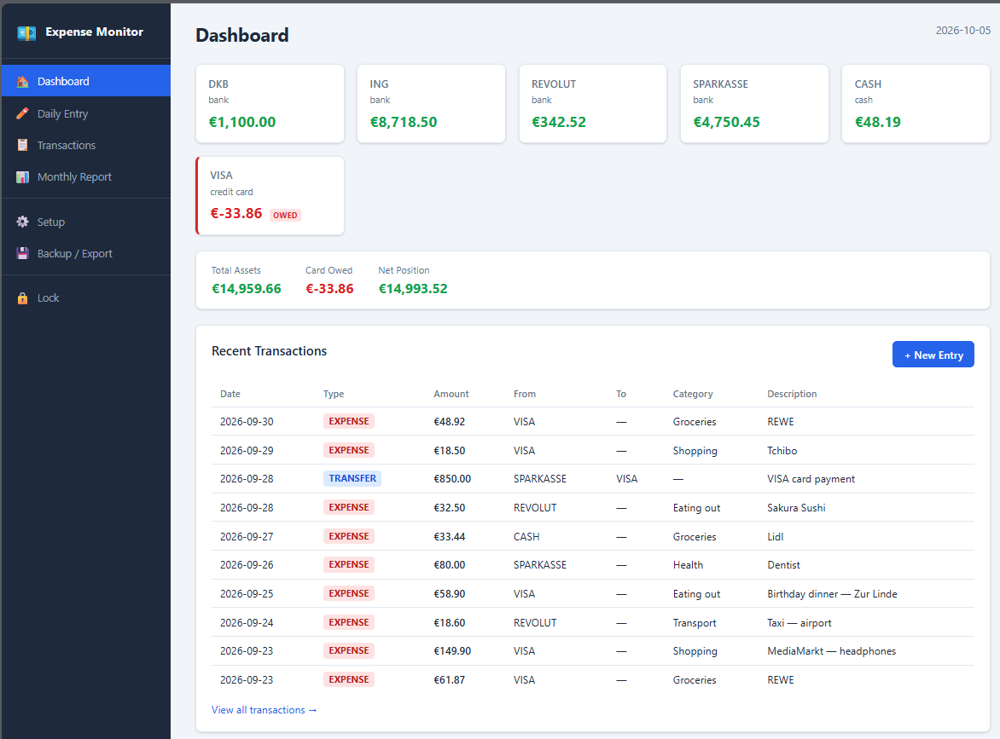
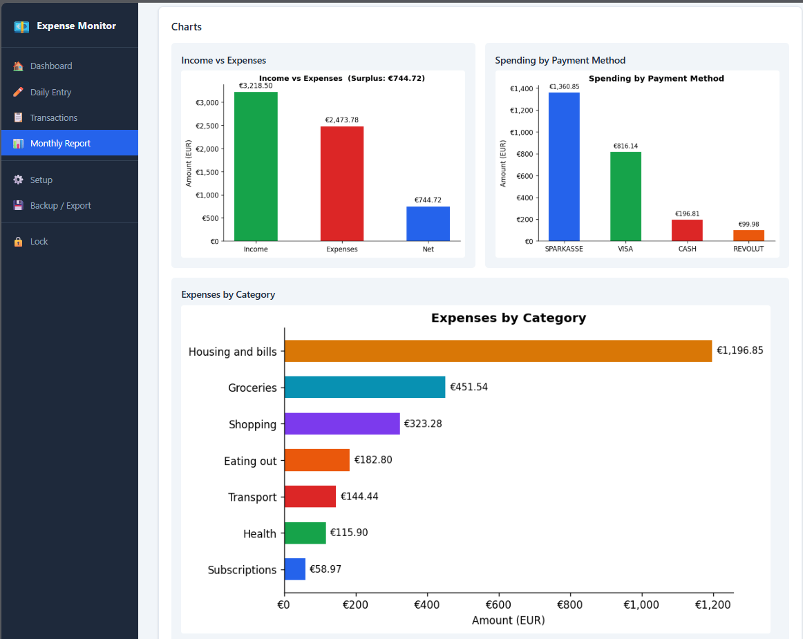
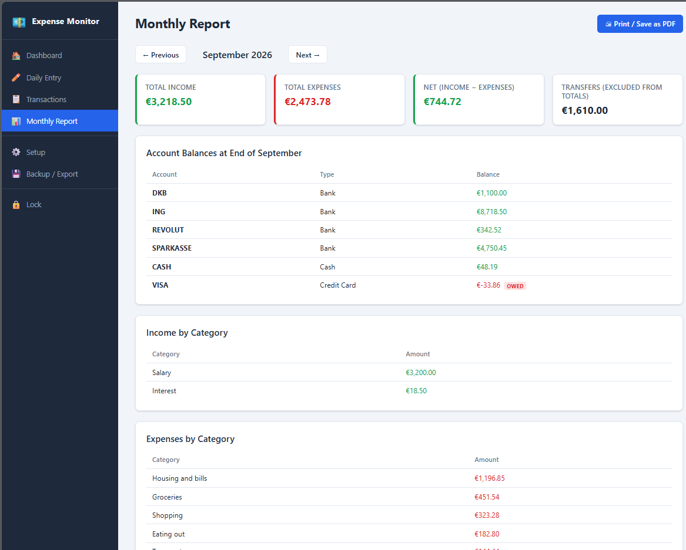

# Expense Monitor

A private, offline personal-expense tracking app for German household finances.
Built with Python, FastAPI, and SQLite. All data stays on your PC.

---

## Preview







The monthly report can be saved as a PDF directly from the browser using **Print → Save as PDF**. Charts, totals, and transaction tables are all print-optimised and paginate cleanly. The PDF below was exported from the demo database for September 2026.

[Monthly Report — September 2026 (PDF)](<docs/demo/Monthly Report — September 2026 — Expense Monitor.pdf>)

---

## Getting Started (after cloning)

```
setup.bat
```
Installs all dependencies into a local virtual environment. Run this once — requires internet.

After that, two ways to launch:

| Command | Database | Purpose |
|---|---|---|
| `run.bat` | `data/expense_monitor.db` | Your own fresh database |
| `run_demo.bat` | `data/demo.db` | Pre-loaded September 2026 demo data |

`run_demo.bat` creates `demo.db` automatically on first run if it does not exist — no extra steps needed.

---

## Installation (one-time, requires internet)

1. Install **Python 3.10+** from https://python.org if not already installed.
2. Open a terminal in this folder.
3. Run:
   ```
   setup.bat
   ```
   This creates a virtual environment and downloads all dependencies.

---

## Running the App (offline)

```
run.bat
```

Open your browser at **http://127.0.0.1:8000**

The app binds only to `127.0.0.1` (localhost) and is not accessible from other devices.

---

## PIN Protection

The app is protected by a PIN. On your very first visit you will be prompted to
choose one (minimum 4 characters — longer and alphanumeric is safer). After that,
every new browser session requires the PIN to unlock.

### PIN behaviour
- **Session length** — 8 hours. After that, or after restarting the app, you must
  enter the PIN again.
- **Lock manually** — click **Lock** at the bottom of the sidebar at any time.
- **Wrong attempts** — 3 consecutive wrong attempts trigger a 30-second cooldown.
- **Change PIN** — go to **Setup → Change PIN**. You need to supply the current PIN
  to set a new one.

### How the PIN is stored
The PIN itself is never saved. What is stored is a one-way cryptographic hash
produced by **PBKDF2-HMAC-SHA256** (100,000 iterations, random salt). The hash
lives in the `settings` table of `data/expense_monitor.db` under the key
`pin_hash`. It is computationally infeasible to reverse a hash back into the PIN.

### Security limits — read this
| Threat | Protection level |
|---|---|
| Someone on your network reaching the app | **Full** — the server only accepts `127.0.0.1` |
| Someone at your PC guessing the PIN in the browser | **Full** — lockout after 3 wrong attempts |
| Someone who copies `expense_monitor.db` and attacks the hash offline | **Partial** — PBKDF2 makes each guess slow (~100 ms), but a short all-numeric PIN (e.g. `1234`) has only 10,000 combinations. Use a longer PIN with mixed characters. |
| Someone who opens `expense_monitor.db` directly with a SQLite viewer | **None** — the PIN protects the web interface only; the database file is **not encrypted** |

**Recommendation:** if the PC is shared or contains sensitive balances, enable
**Windows BitLocker** (or another full-disk encryption tool) on the drive that
holds this folder. That protects the database file itself, which is outside the
scope of this app.

---

## First-Time Setup in the App

1. Enter your PIN on the first-visit screen to create it.
2. Go to **Setup** in the sidebar.
3. Enter opening balances and opening dates for each account (BANK-1 through BANK-4, CARD, CASH).
4. Rename account labels to your liking (e.g. "SPARKASSE", "ING").
5. Add or remove expense/income categories if needed.

---

## Entering Transactions

### Single Entry
1. Go to **Daily Entry → Single Transaction**.
2. Select date, type, amount, account(s), category, and description.
3. Click **Save Transaction**.

### Batch Entry from Phone Note
1. During the day, jot transactions on your phone in this format (one per line):
   ```
   DATE | TYPE | AMOUNT | FROM_ACCOUNT | TO_ACCOUNT | CATEGORY | DESCRIPTION
   ```
   Use `-` for fields that don't apply. Example:
   ```
   2026-10-04 | EXPENSE  | 18.70  | CARD   | -      | Eating out | Lunch
   2026-10-04 | INCOME   | 3200   | -      | BANK-1 | Salary     | October salary
   2026-10-04 | TRANSFER | 50.00  | BANK-1 | CASH   | -          | ATM withdrawal
   2026-10-04 | TRANSFER | 200.00 | BANK-1 | CARD   | -          | Card payment
   ```
2. In the evening, go to **Daily Entry → Batch Paste**.
3. Paste your note and click **Preview Entries**.
4. Review the parsed table. Uncheck any row you want to exclude.
   - Invalid rows are shown in red and cannot be saved.
   - Likely duplicates (same date/type/amount/account) are flagged in yellow.
5. Click **Confirm & Save**.

### Transaction Types

| Type     | FROM_ACCOUNT  | TO_ACCOUNT | Counts as           |
|----------|---------------|------------|---------------------|
| EXPENSE  | Paying account| `–`        | Expense             |
| INCOME   | `–`           | Receiving  | Income              |
| TRANSFER | Source        | Destination| Neither             |

**Credit card notes:**
- A card purchase is an **EXPENSE** with `FROM_ACCOUNT = CARD`. Counted once as an expense.
- Paying the credit card from your bank is a **TRANSFER** (`BANK-1 → CARD`). Not a second expense.
- The card balance shown is the **amount owed** (liability), displayed in red.

---

## Monthly Report

1. Go to **Monthly Report**.
2. Use the Previous/Next buttons to navigate months.
3. The report shows:
   - Income/expense totals and net
   - Account balances at end of month
   - Income and expense breakdowns by category
   - Charts: income vs expenses, spending by payment method, expenses by category, daily spending
   - Full transaction table, with transfers listed separately
4. To **save as PDF**: click the **Print / Save as PDF** button (or press `Ctrl+P`), then choose "Save as PDF" in the print dialog.

---

## Database Location and Backup

The SQLite database is stored at:
```
<app folder>/data/expense_monitor.db
```

### Backing Up
- Go to **Backup / Export → Database Backup** and click **Download expense_monitor.db**.
- Or copy `data/expense_monitor.db` to an external drive or cloud storage manually.

### Restoring from Backup
1. Stop the app (`Ctrl+C` in the terminal).
2. Copy your backup file to `data/expense_monitor.db` (replace existing file).
3. Start the app again.

> **Note:** your PIN hash is stored inside the database, so it is preserved in
> backups automatically. Restoring a backup restores both your transactions and
> your PIN.

### Exporting to CSV
- Go to **Backup / Export → Export Transactions to CSV**.
- Optionally filter by date range, then click **Download CSV**.
- The CSV can be opened in Excel or LibreOffice Calc.

---

## Running Tests

With the virtual environment active:
```
venv\Scripts\pytest tests\ -v
```

Tests cover:
- Accounting rules (balance calculations, all transaction types)
- Parser (valid/invalid log entries, German decimal commas, duplicate detection)
- Monthly report calculations (totals, category breakdowns, transfer exclusion)

---

## Offline Operation

After running `setup.bat` once (requires internet), the app runs **fully offline**:
- No CDN, no remote API, no cloud sync.
- All assets (Python libraries, CSS, JS) are installed locally.
- Charts are generated server-side using matplotlib.

---

## Account Types Reference

| Label  | Type        | Balance Meaning             |
|--------|-------------|-----------------------------|
| BANK-1 | Bank        | Money available (asset)     |
| CASH   | Cash        | Cash on hand (asset)        |
| CARD   | Credit Card | Amount owed (liability, red)|

---

## Troubleshooting

**App won't start:** Make sure Python 3.10+ is installed and `setup.bat` was run.

**"Module not found" error:** Activate the venv first: `venv\Scripts\activate`

**Database locked:** Only one instance of the app should run at a time. Close other instances and retry.

**Charts not showing:** matplotlib is required. Run `venv\Scripts\pip install matplotlib` if missing.

**Forgot PIN:** There is no recovery prompt by design. To reset the PIN:
1. Stop the app.
2. Run: `venv\Scripts\python -c "import database as db; db.init_db(); conn=__import__('sqlite3').connect('data/expense_monitor.db'); conn.execute(\"DELETE FROM settings WHERE key='pin_hash'\"); conn.commit(); conn.close(); print('PIN cleared')"`
3. Restart the app and set a new PIN on the first-visit screen.
   Your transactions and account data are untouched.

---

## Acknowledgements

This app was built with the assistance of [Claude](https://claude.ai) by Anthropic.

The full specification used to build it is in [`prompt.md`](prompt.md).
